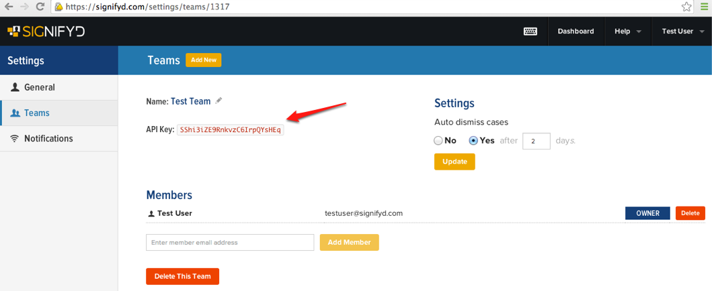
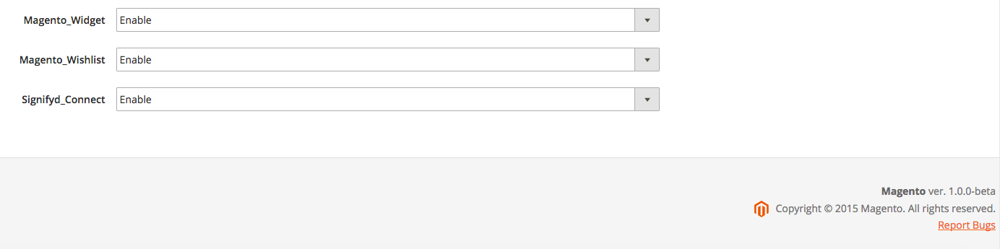
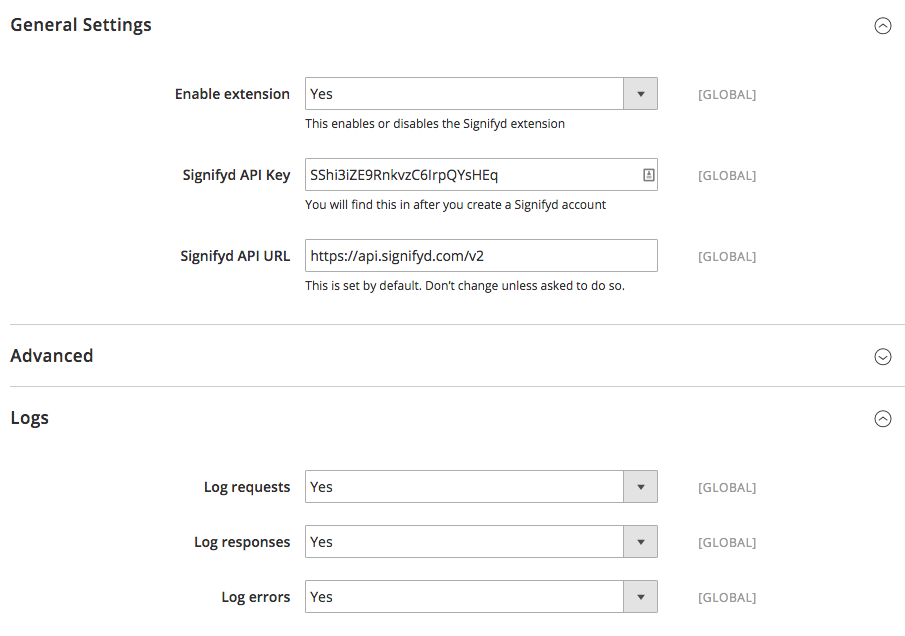
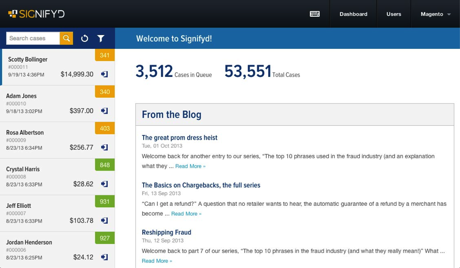
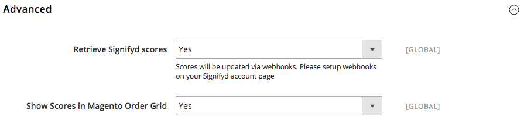
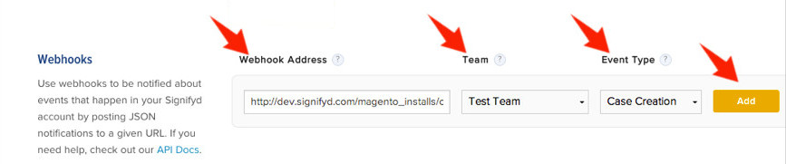
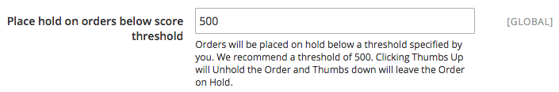
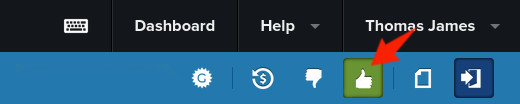
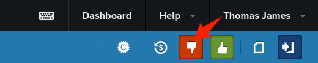
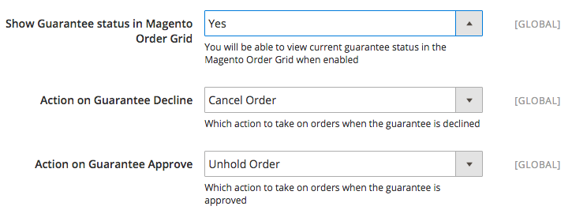

# Signifyd Connect for Magento2 Setup Guide

Follow along with our step-by-step tutorial to learn how to easily install the Signifyd Connect Magento2 Extension. For those that don't yet have a login with Signifyd, we include links to detailed instructions on how to setup your free account.

## Pre-installation Tips

Installing the Signifyd Magento Connect extension is straightforward but it does require working with several accounts at once. You can speed up the process simply by making a few preparations.

- Only Magento Admins can install the Signifyd Magento Extension, so you will need admin access.
- Know the version of Magento2 you are using.
- Log into your Signifyd account and have your "Teams" settings open to quickly get your API key.
- Have the following pages open in your browser so you can move from one to the other while you work.
  - Magento Admin account
  - Signifyd user account
  - Magento Store (to create a test order)

## Setup Signifyd Account

You will need an active Signifyd account with a team to link to your Magento store.

If you have already setup a Signifyd user account and team, login to your account and go to
[`Settings > Teams`](https://www.signifyd.com/settings/teams)
so you will have your API key available, then proceed to **Installation** and **Configuration**.

Otherwise follow the
[instructions to signup for an account](https://signifyd.zendesk.com/hc/en-us/articles/202822508-How-do-I-sign-up-for-a-Signifyd-account-).
Once you have validated your account via email, go to your account settings and follow the
[instructions to create a team](https://signifyd.zendesk.com/hc/en-us/articles/203416786-How-do-I-create-a-team-).

Select and copy the API key for the team. If you have more than one team, make sure you copy the correct API key for the team you want to use. You will use this API key in the **Basic Configuration** step below.

## Install the Signifyd Extension

### Command-Line
You will need shell access to the host running your Magento2 installation along with the rights and privileges to make changes to that installations files. That may mean having admin access. The instructions below are written from a UNIX OS perspective. Windows shell instructions should be similar, though using Windows shell formatting.

1. Obtain the Signifyd Connect plugin either by

   a. Downloading a [release](https://github.com/signifyd/magento2/releases) or
   b. Cloning our [Magento2 git repo](https://github.com/signifyd/magento2/).
2. Ensure the plugin code is somewhere on the server running Magento2, such as in a user directory. All subsequent commands should be run on the Magento2 host. We assume `MAGENTO_HOME` is the directory where Magento2 is installed, e.g., `/var/www/html/magento2/`.
3. Turn off the Magento Cache:  `${MAGENTO_HOME}/bin/magento cache:disable --all`
4. In the plugin code should be a `Signifyd` directory containing a `Connect` directory. If you had cloned the code from GitHub as in step 1b, this would be `magento2/app/code/Signifyd`. Copy this `Signifyd` directory to the existing `${MAGENTO_HOME}/app/code` directory.
5. Ensure the copied directory has the same ownership as `MAGENTO_HOME` and that the owner has write permissions, e.g.,
  - `chown -R www-data:www-data ${MAGENTO_HOME}/app/code/Signifyd/` and
  - `chmod -R u+w ${MAGENTO_HOME}/app/code/Signifyd/`.

  Substitute the proper user and group for `www-data` if using different ones.
6. Enable the plugin: `${MAGENTO_HOME}/bin/magento module:enable --clear-static-content Signifyd_Connect`
7. Run setup:upgrade: `${MAGENTO_HOME}/bin/magento setup:upgrade`. You should see the line `Module 'Signifyd_Connect':` in the output.
8. Re-enable the cache: `${MAGENTO_HOME}/bin/magento cache:enable --all`.

### Magento2 Admin Web UI
(NOTE: Magento2 Connect - not to be confused with Magento Connect 2.0 - is not yet available. Currently the only way to install the Signifyd Connect extension is by the CLI procedure above.)

### Verify
Confirm that the extension has been installed correctly. Got to `Stores > Configuration > Advanced > Advanced` It should look like the image below, with **Signifyd_Connect** listed as **Enable**.

## Basic Configuration

While logged into Magento2 Admin, go to `Stores > Configuration > Services > Signifyd`. You will see three sections: **General Settings**, **Advanced** and **Logs**. We will defer the **Advanced** settings for the moment. Start at **General Settings** and

1. Enable Extension: **Yes**

2. Signifyd API Key: You should have this from your Signifyd Team settings as mentioned in **Pre-install** above.

3. Go down to the **Logs** section and verify all settings are **Yes**, which should be the default.

4. Click `Save Config` at the top right corner of your screen.
 

## Test the Installation

To test that the extension is properly installed, you'll have to either run a test order through your Magento store or wait for a customer to make a purchase. Current and previous orders are not uploaded to Signifyd during installation.

You'll know the app is working when you see your orders in your [Signifyd dashboard](https://www.signifyd.com/cases) like the screenshot below.

## Advanced Settings

When should you use Advanced Settings? 

- To show scores in the Magento Order Grid.
- To automatically HOLD orders below a certain threshold.
- To show Guarantee decisions in the Magento Order Grid and automatically act on orders based on those decisions.

In Magento Admin, go to `Stores > Configuration > Services > Signifyd` and open the `Advanced` section. Note that certain settings will be displayed or hidden based on the values chosen for other settings.

### Show scores in Magento Order Grid

Setup for retrieving and displaying Signifyd scores is actually a two part process, half done in the Magento extension configuration and half done in your Signifyd account settings.

#### In Magento
1. Set **Retrieve Signifyd Scores** to **Yes**. This retrieves the score and stores it in the `signifyd_connect_case` table.
2. Click the URL to confirm callback functionality.

#### In Signifyd - webhook setup

1. Go to Signifyd [`Settings > Notifications`](https://signifyd.com/settings/notifications).
2. Enter the Signifyd callback URL for your store. The URL will be `https://<HOSTNAME-FOR-YOUR-STORE>/signifyd_webhooks/index/index`, e.g., `https://mymagento.example.com/signifyd_webhooks/index/index`.
3. Choose the same team as the one you are using for your Magento store.
4. Choose the **Case Creation** Event Type.
5. Add the webhook. **NOTE:** you are only allowed one URL per team per event type so if you already have a webhook in place for a given team/event pair, it will need to be deleted before the new one can be added.
6. Repeat steps 2-5 for Event Types **Case Review** and **Case Rescore**.

While you may choose to click "Test" by the new webhooks, this simply confirms the URL is valid.  To check that the scoring connection is actually working, an order must be created either by a customer at your store or by placing a test order yourself. Scores from previously submitted orders will not display in your Magento order grid.

### Place Orders on Hold

You can set the extension to automatically hold orders that have received risky, i.e., lower, scores for you own further review.

1. Set **Hold score threshold** to 500 or a score of your choosing. A threshold of zero will never hold orders while 1000 will hold **all** orders.

2. To check that the *On Hold* status is working, an order must be created either by a customer at your store or by placing a test order yourself. The order status from previously submitted orders will not be affected.
3. To release orders in Magento, click the Signifyd Thumbs Up button in the Signifyd case console.

4. To hold orders in Magento, click the Signifyd thumbs-down button in the Signifyd case console.

You could temporarily set the hold score artificially high at, say, 900 (or even 1000 - hold all orders) for a test to increase the likelihood of a hold, but **don't forget to set the threshold back to the desired value!**

### Integrate with Signifyd Guaranteed Payments

[Guaranteed Payments](https://signifyd.zendesk.com/hc/en-us/articles/202790553-What-is-Guaranteed-Payments-)
is part of the Signifyd Complete Plan. To take advantage of Signifyd Guaranteed Payments, please contact [sales@signifyd.com](mailto:sales@signifyd.com).
Once you have enrolled in a Complete Plan, you can integrate that feature into Magento with the following settings.

1. Repeat the webhook setup procedure from **Show scores in Magento Order Grid** above for the Event Type **Guarantee Disposition**.
2. Set **Hold score threshold** mentioned above to 1000 to **hold all orders** until a Guarantee decision is made. **Don't do this if you are *not* on a complete plan!**
3. Choose an **Action on Guarantee Decline** from the drop down menu. **NOTE:** *the Cancel action is currently unavailable*.
4. Choose an **Action on Guarantee Approve** from the drop down menu.

To check that the Guarantee status is working, an order must be created either by a customer at your store or by placing a test order yourself. Note that for the Actions in 3 and 4, **Nothing** is a valid option. However, if you have set all orders to be held in step 2, none will be unheld upon approval if no action is set to be applied. The Guarantee Status from orders submitted prior to enabling this integration will not display in your Magento order grid.

## Troubleshooting
- Not seeing orders on the Signifyd dashboard?
  - Make sure the Basic Configuration settings are correct. The extension should be enabled, using your correct Team API key and the correct URL.
  - Make sure you are not applying a narrow filter to your Signifyd dashboard. You may need to go into your case filter (the funnel icon), reset the filters, and even set `Case Status` to `All` to include closed orders.
- Not seeing Signifyd scores or Guarantee decisions in the Magento order grid?
  - Make sure you have enabled both the retrieval of scores and decisions as well as their display in the extension's **Advanced Configuration**.
  - Also make sure you have setup the webhooks in your Signifyd `Settings > Notifications` that point back to your Magento store and that the webhooks are attached to the proper team, i.e., the team owning the API key used in your extension configuration.

If you tested our Signifyd Magneto extension but you are still not seeing orders or if you have installation questions, please contact us with [the following information](https://signifyd.zendesk.com/hc/en-us/articles/207015797-How-do-I-get-help-with-Magento-).
